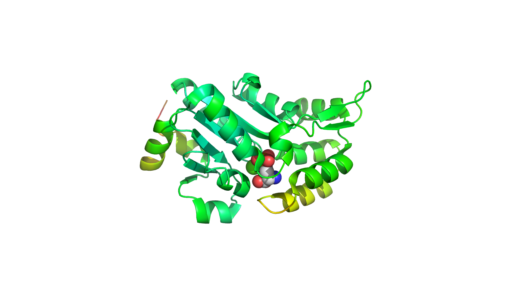
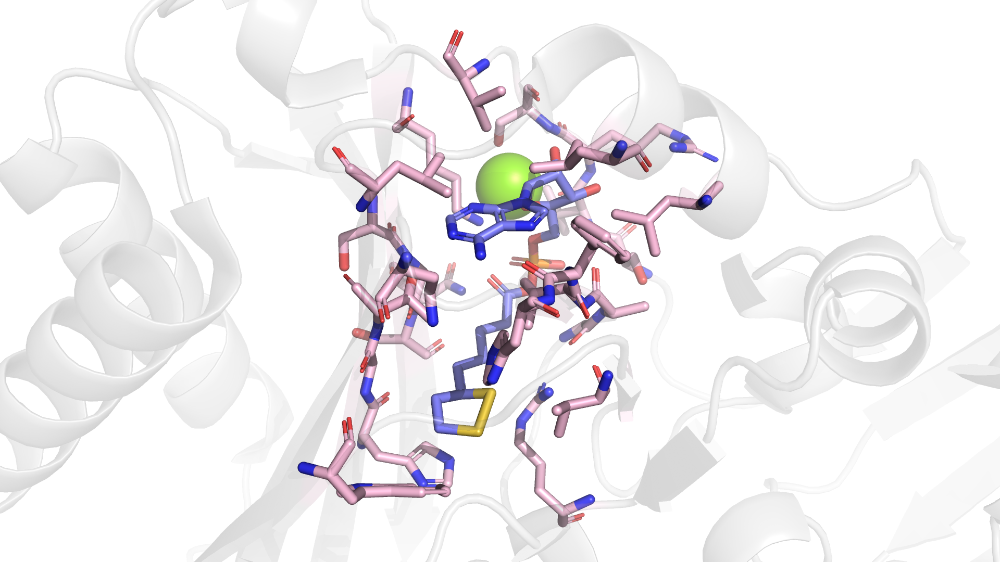
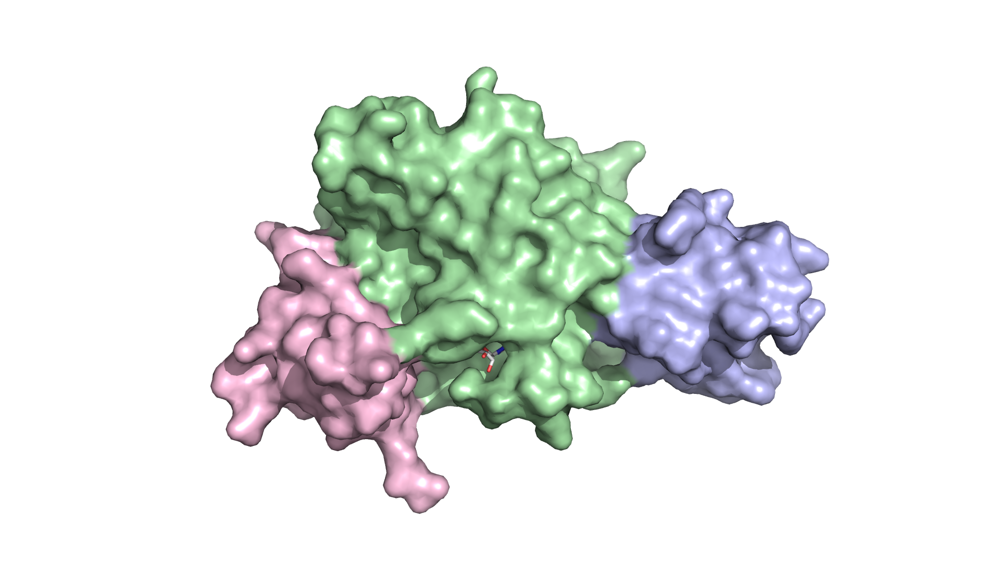
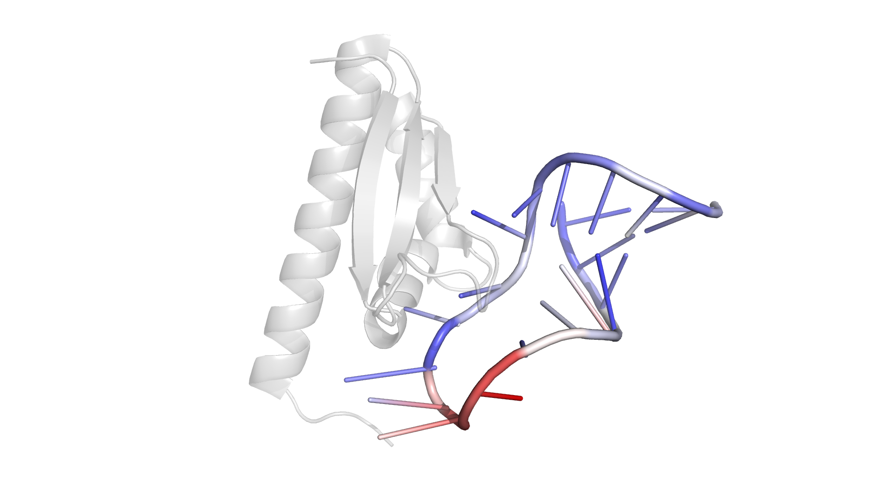

# PyMOLScripts

My PyMOL scripts

## Usage

To use these scripts, you can simply copy `configs/.pymolrc` and `configs/.pymolrc.py` to your home directory which will be loaded automatically by PyMOL.

You may also view and edit these rc files in `PyMOL -> File -> Edit pymolrc`.

## Demos

### Cartoon

### Sticks

### Surface

### Nucleic Acid

